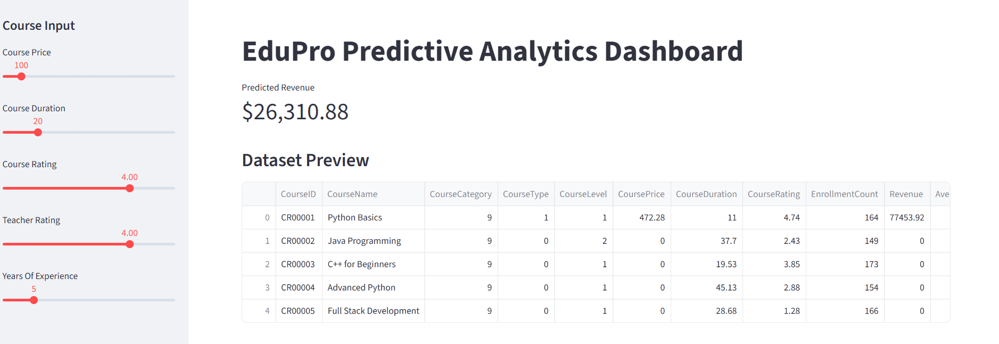
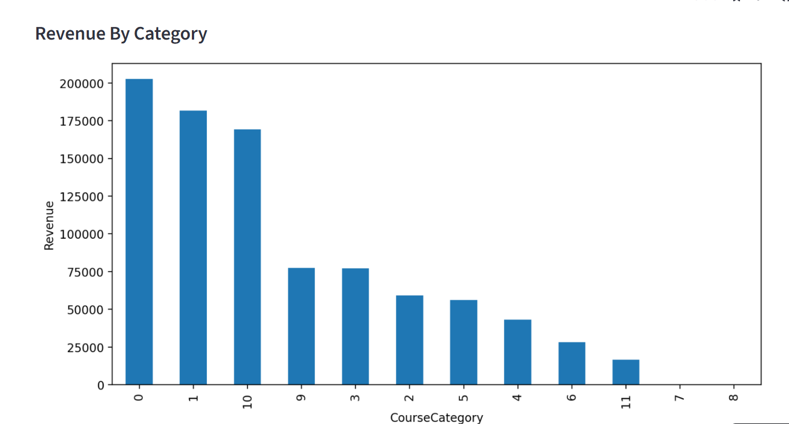
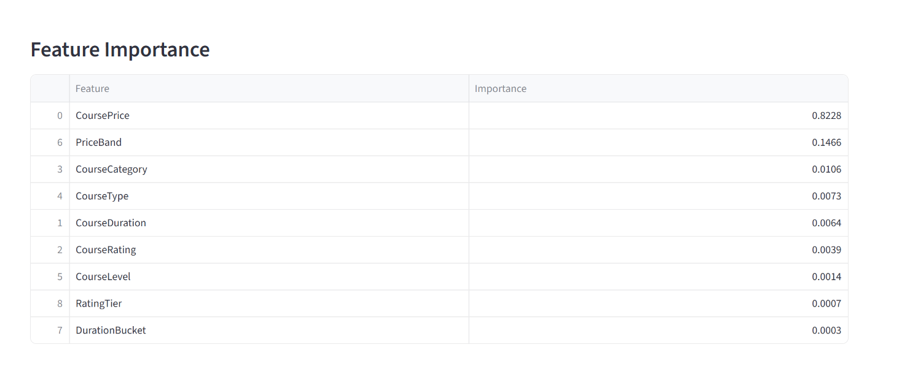
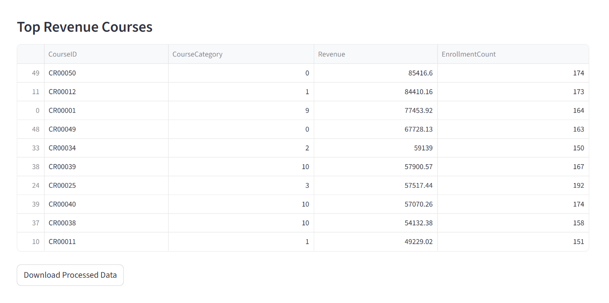

**EduPro Predictive Analytics Dashboard**

**Project Overview**

The EduPro Predictive Analytics Dashboard is a machine learning-powered web application developed using Python and Streamlit to analyze online course performance and predict course revenue.

This project helps educational platforms understand:

Which courses generate the highest revenue

How pricing and ratings affect enrollments

Which features influence revenue prediction

How instructors and course attributes impact business performance

The dashboard provides interactive visualizations, machine learning predictions, and downloadable processed data for better decision-making.

**Features**

Revenue prediction using Random Forest Regression

Interactive Streamlit dashboard

Dynamic feature importance analysis

Revenue visualization by course category

Top-performing courses analysis

Automated data preprocessing

Excel multi-sheet integration

Download processed dataset option

Technologies Used

* Python
* Streamlit
* Pandas
* Scikit-learn
* Matplotlib
* Joblib

**Dataset Description**

**The project uses an Excel dataset containing three sheets:**

**Sheet Name	Description**

**Courses**	**Course** **details** and **attributes**

* Teachers	Instructor information
* Transactions	Revenue and enrollment transactions
* Machine Learning Workflow
* Data Preprocessing
* Clean column names
* Handle missing values
* Merge multiple datasets
* Feature engineering
* Encode categorical variables
* Model Training
* Train-test split
* Random Forest Regressor training
* Revenue prediction
* Evaluation Metrics
* MAE (Mean Absolute Error)
* RMSE (Root Mean Squared Error)
* R² Score
* Dashboard Modules
* Revenue Prediction

**Users can:**

Select course price

Choose duration

Set ratings

Adjust instructor experience

The model predicts estimated course revenue instantly.

**Revenue by Category**

Bar chart visualization showing total revenue generated by each course category.

**Feature Importance**

Displays the importance of each feature used in prediction.

**Top Revenue Courses**

Shows the highest-performing courses based on revenue.

**Project Structure**

**EduPro-Predictive-Analytics/**

│

├── app.py

├── model.py

├── preprocessing.py

├── revenue\_model.pkl

├── requirements.txt

├── README.md

└── EduPro Online Platform.xlsx

**Installation**

**Clone Repository**

* git clone https://github.com/your-username/EduPro-Predictive-Analytics.git
* Navigate to Project Folder
* cd EduPro-Predictive-Analytics
* Install Dependencies
* pip install -r requirements.txt
* Run Streamlit App
* streamlit run app.py
* Requirements

**Create a requirements.txt file with:**

* streamlit
* pandas
* matplotlib
* scikit-learn
* joblib
* openpyxl
* Sample Output

**The dashboard includes:**

* Revenue prediction metric
* Course analytics tables
* Revenue visualization charts
* Feature importance ranking
* Future Enhancements
* Deploy on Streamlit Cloud
* Add deep learning models
* Real-time database integration
* Advanced business intelligence dashboards
* Student retention analytics

\*\*# 🖼️ Dashboard Screenshots\*\*

\*\*## 🔹 Main Dashboard\*\*

\*\*## 🔹 Charts\*\*

\*\*## 🔹 Feature Importance\*\*

\*\*---\*\*

\*\*## 🔹 Top Revenue\*\*

**Author**

Kalyan Kumar

**GitHub Profile**

**GitHub** : https://github.com/kalyankumar09-m/Predictive-Modeling-for-Course-Demand-and-Revenue-Forecasting-on-EduPro-analysis.git

**Live link :https://hsdedcjapfkzvtega4pwfh.streamlit.app/**

